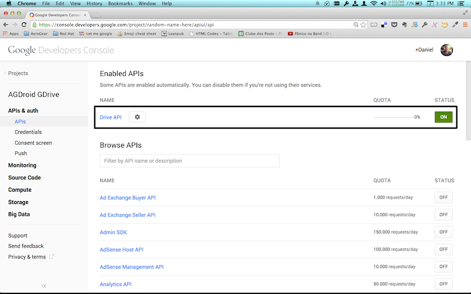
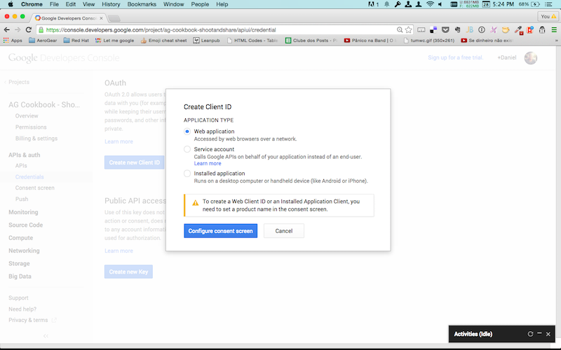

Google Account Setup
====================

First, you must authenticate with Google. You will need a Google Account for this. Now open the [Google Console](http://console.developer.google.com).

If you haven't created a project, click "Create Project" and give the new project a name:

Now you need to enable the Drive API. To do that, navigate to APIs & auth > APIs and scroll down to the Drive API item, which you need to turn on:

Now you need create new credentials to access your Drive accounts from the app. Go to APIs & auth > Credentials and inside OAuth area click the blue `Create new Client ID` button. 

You will need to create a _consent screen_. Click the blue `Configure consent screen`

Afterwards, click save and you will return to the Client ID. Select `Installed application` and `iOS` and fill in your bundleId, these settings will work for Android and iOS:

On the last screen we finally get to see the actual value of the generated `client id`, `secret id` and `redirect uris`, which you will use later:

